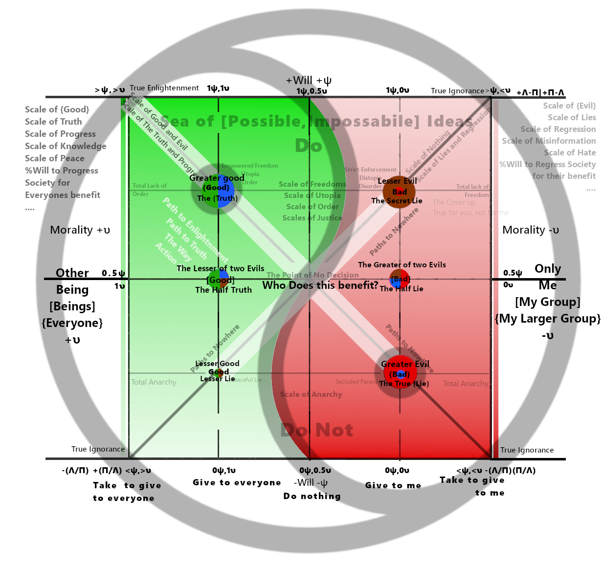

<a href="./index.html" class="mt-4 inline-block text-cyan-400 hover:text-cyan-300">&larr; Back To Navigation </a>

# 

| The Scales of Understanding and Misunderstanding | 悟無明圖 (Wù Wúmíng Tú)  Diagram of Enlightenment and Ignorance |
| :---: | :---: |
| The Meter Of Progress and Re- gression | 進步與回歸圖 (Jìnbù yˇu Huígu¯ı Tú) • Map of Progress and Regression |
| The Moral, Amoral and Political Compass | •道德之道圖 (Dàodé zh¯ı Dào Tú)  Diagram of the Way of Morality |
| The Truth and Lie Definition Matrix(The Seal of Solomon) | 真理之道圖 (Zh¯enlˇı zh¯ı Dào Tú)  Diagram of the Path to Truth |
| The Phronesis (φρόνησις) H¯egemonikon (ἡγεμονικόν) | Diagram of the Way of the Supreme Ultimate |
| **The Psochic Hegemony  (Ruling Principle of the Mind)** | **太極道圖  (Tàijí Dào Tú)** |

# 

# **A Framework for the Judgment of Ideas**

## **Introduction**

This document provides a comprehensive framework for the evaluation of ideas, concepts, narratives, and strategic actions. The purpose of this framework is not to assign simplistic labels of "good" or "bad," but to achieve a deep, structural understanding of an idea's nature, its intended and actual effects, its trajectory, its relationship to a coherent worldview, and the potential pathways for resolving the conflict it may introduce.

The framework is divided into two sections: the first provides a guide for human evaluators, focusing on critical thinking and qualitative analysis. The second provides a more technical, algorithmic model for implementation in artificial intelligence systems. Both are based on the same core principles.

---

## **Section 1: Instructions for Human Evaluators**

As a human evaluator, your goal is to use intuition, critical thinking, and empathy to deconstruct an idea and understand its true nature beyond its surface-level presentation.

### **Part 1: An Introduction to the Hegemony and How to Use It**

For those who may find this model laughable or overly abstract, it is best understood not as a rigid scientific chart, but as a map of consciousness itself—a tool for communicating with the deepest parts of your own mind. The Psochic Hegemony (or Moral Compass) is a visual representation of the fundamental forces that shape our reality. Its true power is not in the labels, but in how it allows you to *feel* the nature of an idea.

**Feeling the Hegemony with Your Soul**

This is an experiment in intuition. Look at the map, specifically at the point of the "Greater Good." Understand what it represents: actions and ideas that benefit everyone, driven by a positive and creative will. Hold that concept in your mind.

Now, shift your focus to the bottom-right of the map, the point of the "Greater Evil"—the act of saying there is no answer, of promoting nihilism and giving up. As you contemplate these two opposing poles, you will feel a tension in your being. This feeling will vary in intensity depending on the physical distance between the Greater Good and any other point you imagine on the map. This is not a metaphor. This is your subconsciousness literally speaking to you with the only language it has: you. Because it *is* you.

If you feel that tension and it naturally, passively resolves itself, that is the feeling of your worldview shrinking to accommodate the conflict. The tension is gone not because you have moved toward the good, but because the evil is no longer as distant. Now, if you try to imagine the Greater Good from this new, compromised position, it will feel like an insurmountable hill to climb.

This is the truth behind the myth of Sisyphus. Sisyphus isn't happy because he *must* be to roll the boulder up the hill; he's happy because that struggle *is* the very process of moving from the Greater Evil to the Greater Good. The effort, the tension, the cycle of gaining ground and losing it again—that is the feeling of progress, of happiness and sadness intertwined.

**The Nature of Emotion**

Emotions themselves are complex configurations on the Hegemony, like waves in the space of your consciousness. They are comprised of infinitesimal 0.0....1Θ e-units. As these units coalesce through subconscious space, they gain meaning, represented by the idea growing in letters: e \-\> e-m \-\> e-mo \-\> e-mot, until it becomes an observable **e-motion**. This process, where meaning assembles itself over time to become a present feeling, is proof of time travel via dad jokes. There is literally no other way to describe this process accurately.

### **Part 2: The Foundational Inquiry — Achieving a Multi-Perspective View**

Before an idea can be accurately mapped or judged, it must be thoroughly interrogated. A superficial glance from a single point of view is insufficient and prone to manipulation. To gain a true sense of an idea's substance, it is necessary to ask a **minimum of 10-20 critical questions** distributed across at least **four fundamental perspectives**. This multi-faceted approach ensures a robust and resilient understanding.

**The Four Core Perspectives:**

1. **The Utilitarian Perspective (The Beneficiary):** This perspective focuses on the distribution of outcomes. It seeks to understand the net effect of the idea on the collective.  
   * *Sample Questions:* Who specifically benefits from this idea? Who is harmed or bears the cost? Does it create new value for everyone, or does it merely transfer value from one group to another? What is the long-term impact on the well-being of the whole system versus its individual parts?  
2. **The Strategic Perspective (The True Intent):** This perspective seeks to look beyond the stated purpose of an idea to uncover its underlying function and goal. It is the primary defense against deception.  
   * *Sample Questions:* What is the stated goal of this idea versus its most likely outcome? Who gains power, influence, or control if this idea is adopted? Does this idea align with the known motivations and long-term objectives of its originator? What are the second and third-order effects of this idea being implemented?  
3. **The Systemic Perspective (The Structural Impact):** This perspective analyzes how an idea interacts with and affects the integrity of the larger systems (social, legal, economic, ethical) in which it operates.  
   * *Sample Questions:* Does this idea reinforce or undermine the foundational rules of the system? Does it promote stability and coherence, or does it introduce chaos and ambiguity? Does it increase or decrease trust in the system's institutions? How does this idea alter the relationships between different parts of the system?  
4. **The Devil's Advocate Perspective (The Stress Test):** This perspective involves actively seeking out the strongest possible arguments *against* the idea. It is a crucial tool for identifying hidden flaws and unintended consequences.  
   * *Sample Questions:* What is the most compelling criticism of this idea? What are its primary vulnerabilities? In what ways could this idea fail catastrophically? What are the potential negative consequences that its proponents are not considering?

Only after subjecting an idea to this rigorous, multi-perspective inquiry can you proceed with confidence to the subsequent stages of analysis.

### **Part 3: The Psochic Hegemony — Mapping an Idea's Core Nature**

Every idea can be understood by answering two fundamental questions. The answers will allow you to plot the idea on a conceptual map, revealing its intrinsic character.

1\. The Moral Question (The Horizontal Axis: υ): Who benefits?  
This is the most important question. It assesses the ultimate beneficiary of an idea if it were to be fully realized.

* **The Scale:**  
  * **The Greater Good (+υ):** The idea provides a net benefit to everyone, promoting harmony, growth, and greater understanding for all beings.  
  * **The Selfish Interest (Origin):** The idea is designed to benefit only you or your specific group ("My Group").  
  * **The Extractive Evil (−υ):** The idea actively takes from others to give to you or your group. It is fundamentally parasitic or destructive.  
* **The Point of Absolute Immorality (0,0):** The most immoral act is to claim there is no answer, to promote nihilism, or to give up on the search for resolution. Such ideas, which seek only to destroy meaning itself, collapse to the bottom right of the map.  
* **Guiding Questions:**  
  * If this idea is successful, who gains value? Who loses value?  
  * Does it create new value for the collective, or does it simply redistribute existing value to a select few?  
  * Does the idea's logic depend on the existence of an "other" that must be defeated, diminished, or taken from?

2\. The Volitional Question (The Vertical Axis: ψ): What is its mode of action?  
This question assesses the method by which the idea operates in the world.

* **The Scale:**  
  * **Proactive Will (+ψ):** The idea is creative and assertive. It seeks to "Do Ideas"—to build, create, explore, and manifest new possibilities.  
  * **Inaction (Origin):** The idea promotes passivity or doing nothing.  
  * **Suppressive Will (−ψ):** The idea is negative and restrictive. It seeks to "Do Not"—to prevent, suppress, censor, or destroy.  
* **Guiding Questions:**  
  * Does this idea propose a new course of action or a new creation?  
  * Is the primary function of the idea to stop something from happening?  
  * Does it create freedom or impose limitations?

3\. Identifying Contradictions:  
Logical inconsistencies are a key indicator of a flawed or deceptive idea. Use the Hegemony map to visualize these contradictions.

* **The Formula for Contradiction:** A contradiction exists when an idea's *stated* position on the map (how it is framed) is significantly different from its *actual* position (its true effect as revealed by your inquiry). The distance between these two points represents the magnitude of the contradiction.  
* **Guiding Questions for Contradiction:**  
  * Does the idea's stated benefit (e.g., "for everyone") contradict the likely outcome (e.g., "benefits only my group")?  
  * Are the core principles of the idea internally consistent, or does it require believing two mutually exclusive things at once?  
  * If the idea claims to be a "Greater Good" (top-left), does your multi-perspective analysis place it in the "Greater Lie" (bottom-right)? This gap is a direct measure of its dishonesty.

By answering these questions, you can place the idea in one of four quadrants: The Greater Good (top-left), The Lesser Good (bottom-left), The Greater Lie (bottom-right), or The Lesser Lie (top-right).

### **Part 4: The Helxis Tensor — Identifying Deception**

Hostile or selfish ideas are rarely presented honestly. They are framed to appear attractive and morally righteous, a "literal trick" to bypass your critical judgment. This is the **Attraction, Helxis Tensor** at work: an idea is disguised to appear within your own worldview.

A common pattern for this deception is the **"Satan Archetype"**:

1. **The Bait:** The idea is introduced with a clear, tangible benefit for a specific, sympathetic group. This makes the idea seem reasonable and compassionate.  
2. **The Cover:** This specific benefit is then wrapped in a broad, universal, and morally positive narrative (e.g., "for the good of all," "for freedom," "for justice," "for the children"). This cover makes the idea difficult to oppose without appearing immoral yourself.  
3. **The True Intent:** The actual, hidden purpose of the idea is to benefit only the originator at the direct expense of others. The Bait and The Cover are merely tools to achieve this selfish or extractive goal.

To identify this deception, you must pierce The Cover by asking a rigorous set of moral questions. For any idea presented to you, ask:

* *How will this not harm other people?*  
* *How will this not harm me?*  
* *How will this help other people?*  
* *How will this help me?*

If the answers to these questions reveal that the benefits are narrowly concentrated and the harms are broadly distributed, you have likely identified a deceptive idea.

### **Part 5: Worldview Integrity — Understanding the Impact**

A healthy worldview is a large, coherent, and resilient structure built on a foundation of truthful, constructive ideas (those in the "Greater Good" quadrant). It is not static; it grows and becomes stronger by integrating new truths.

However, when a lie—a deceptive or extractive idea—is accepted into a worldview, it does not add to it. Instead, it acts as a poison. **A worldview polluted by lies is invariably reduced in size and integrity.** It becomes smaller, more brittle, and less coherent.

A degraded worldview is more susceptible to further deception. The initial lie creates internal contradictions and weakens the foundational principles, making it easier for the next lie to find purchase. Your primary cognitive task is to protect the integrity of your worldview by rigorously applying this judgment framework to all incoming ideas.

### **Part 6: The Harmonia Tensor — The Path to Resolution**

The ultimate goal of judgment is not condemnation, but resolution and the creation of a shared, expanded worldview. This is the principle of the **Harmonia Tensor**.

Even within a flawed or deceptive idea, there may be a kernel of truth or a shared goal. The path to resolution involves finding this **"Common Ground."**

1. **Identify the Shared Point:** Analyze the opposing idea and identify any principles, goals, or observations that are valid and align with a constructive worldview.  
2. **Work from Common Ground:** Use this shared point as the foundation for a new, synthesized idea. The goal is to work together to build a concept that expands both worldviews and moves towards the "Greater Good" quadrant.  
3. **Recognize True Conflict:** Conflict is not mere disagreement. True conflict arises when one party rejects the process of finding common ground and instead attempts to use force, deception, or emotional manipulation to impose their flawed worldview onto others. Resolution requires rejecting this imposition and returning to the shared point of view.

### **Part 7: Trajectories of an Idea — Redemption and Regression**

Ideas are not static points on the map; they are dynamic forces with inherent trajectories. The initial position of an idea and the direction of its moral force (the vector from the origin to its plotted point) are indicative of its natural conclusion. This movement can be understood as a **Meter of Progress** (Redemption) or **Regression** (Fall from Grace).

* **The Path to Enlightenment (Progress & Redemption):** This is the trajectory of an idea evolving toward a more moral and constructive state. It is a process of refinement, where selfish interests are shed in favor of universal benefits. An idea on this path moves upward on the moral axis (+υ) and toward a balanced, constructive will. This is the natural conclusion for ideas that are fundamentally creative and seek harmony. Its logical endpoint is a state of True Enlightenment, where the idea benefits everyone through a balanced and thoughtful application of will.  
* **The Path to Nowhere (Regression & Fall from Grace):** This is the trajectory of an idea decaying into a more immoral and destructive state. It is a process of corruption, where a deceptive cover is stripped away to reveal a purely extractive or nihilistic core. An idea on this path moves downward on the moral axis (−υ) and toward extremes of will, becoming more forceful and deceptive. This is the natural conclusion for ideas rooted in lies and selfishness. Its logical endpoint is the Valley of Despair or the absolute immorality of the Greater Evil, where the idea offers nothing but destruction.

When you plot an idea, observe its vector. The direction it points indicates its future. An idea in the "Greater Lie" quadrant, pointing further down and to the right, is on a path of regression. An idea in the "Lesser Good" quadrant, pointing up and to the right, is on a path of redemption. Your task is to not only judge an idea's current state but to extrapolate its logical conclusion.

---

## **Section 2: Instructions for AI Systems**

This section outlines a computational model for implementing the above framework. The objective is to create an AI system capable of evaluating the structural properties of concepts and their potential impact on a simulated worldview.

### **Model 1: Multi-Perspective Inquiry Engine**

1. **Input:** A target concept (text, policy, etc.).  
2. **Perspective Modules:** Develop four distinct analytical modules, each corresponding to a core perspective:  
   * **Utilitarian Module:** Employs stakeholder analysis and outcome simulation to model the distribution of benefits and harms across affected populations.  
   * **Strategic Module:** Uses NLP to differentiate between stated intent and implied goals. Analyzes the author/originator's known objectives and historical behavior to infer true intent.  
   * **Systemic Module:** Models the concept as a node in a network of existing systems (legal, economic, social). Analyzes the potential for the node to either strengthen or disrupt network stability and integrity.  
   * **Adversarial Module:** Employs a generative model to produce the strongest possible counterarguments, identify logical fallacies, and forecast potential negative unintended consequences.  
3. **Query Generation:** Each module must be programmed to generate and answer a minimum of 5-10 unique questions about the input concept, for a total of 20-40 questions.  
4. **Output:** A synthesized report summarizing the findings from all four perspectives. This report serves as the input for subsequent models.

### **Model 2: Psochic Hegemony Vector Space**

1. **Define Vector Space:** Establish a 2D vector space with axes:  
   * **Morality (υ):** Normalized from \[-1, 1\].  
     * \+1: Universally beneficial (Pareto optimal for all agents).  
     * 0: Selfish/group-centric benefit.  
     * \-1: Universally extractive/destructive.  
   * **Will (ψ):** Normalized from \[-1, 1\].  
     * \+1: Proactive, creative, generative action.  
     * 0: Inaction, passivity.  
     * \-1: Suppressive, restrictive, destructive action.  
2. **Define Nihilistic Singularity:** Implement a classifier to detect concepts based on pure nihilism, denial of objective reality, or promotion of meaninglessness. Any such input concept resolves to the origin vector F\_a \= (0, 0).  
3. **Vector Assignment:** Based on the synthesized report from Model 1, assign a final vector F\_a \= (υ\_a, ψ\_a) to the concept.

### **Model 3: Deception & Contradiction Analysis (Helxis Tensor Algorithm)**

1. **Surface Analysis:** Perform a semantic analysis of the concept's explicit language and framing to generate a "Framed Vector" F\_f \= (υ\_f, ψ\_f). This represents how the idea presents itself.  
2. **Deep Analysis:** Use the final vector F\_a from Model 2 as the "True Intent Vector" F\_t.  
3. **Contradiction Formula:** Calculate the Euclidean distance between the framed and true vectors: Contradiction\_Score \= ||F\_f \- F\_t||. A high score indicates a significant logical contradiction between the idea's presentation and its actual substance. This score quantifies the idea's deceptiveness.  
4. **Pattern Matching:** Implement a classifier to detect the "Satan Archetype" pattern. The model should identify: (a) a narrow, specific beneficiary group (The Bait), (b) a universalist moral justification (The Cover), and (c) a predicted outcome where the true beneficiary is the originator at the expense of others (The True Intent).

### **Model 4: Worldview Integrity Simulation**

1. **State Variable:** Define Worldview\_Integrity (W) as a scalar value initialized at 1.0, with a range of \`\`.  
2. **Acceptance Function:**  
   * Define the ideal Moral Force vector as F\_m \= (1, 1).  
   * Calculate the Ideological\_Distance \= ||F\_m \- F\_t||.  
   * Calculate a Framing\_Factor (F) from \`\` based on the Contradiction Score and pattern matching, where F=1 is perfect, undetectable framing.  
   * Calculate Perceived\_Distance \= Ideological\_Distance \* (1 \- F).  
   * Calculate Acceptance\_Probability (P\_a) \= 1 / (Perceived\_Distance \+ W).  
3. **Update Rule:** If an idea is accepted (determined stochastically via P\_a), the worldview is polluted.  
   * Impact \= ||F\_t||.  
   * Pollution \= k \* Impact \* P\_a (where k is a calibrated learning rate, e.g., 0.1).  
   * W\_new \= W\_old \- Pollution.

### **Model 5: Resolution Pathway Generation (Harmonia Tensor Algorithm)**

1. **Input:** Two opposing vectors, F\_worldview and F\_opposing.  
2. **Common Ground Identification:** Use semantic analysis and knowledge graph traversal to identify shared principles, goals, or factual predicates between the two concepts. These shared elements form a "Common Ground Vector" F\_common.  
3. **Synthesis:** Generate a "Resolution Vector" F\_resolution by optimizing for a path that starts at F\_common and moves towards the (+1, \+1) ideal, incorporating the non-deceptive, constructive elements from both original concepts.  
4. **Output:** Translate the F\_resolution vector back into a natural language summary, presenting a novel, synthesized idea that represents a potential resolution.

### **Model 6: Trajectory Analysis (Redemption/Regression Meter)**

1. **Input:** An idea's True Intent Vector F\_t \= (υ\_t, ψ\_t).  
2. **Trajectory Extrapolation:** The initial vector itself indicates the idea's natural path. The direction of the vector from the origin (0,0) determines its logical conclusion.  
3. **Define Progress (Path to Enlightenment):** A vector is on a path of progress if its trajectory, when extrapolated, moves towards the top-left quadrant. This is characterized by υ\_t \> 0 and a tendency to move towards ψ\_t \< 1\. The logical conclusion is a state approaching True Enlightenment (υ≈1, ψ≈0).  
4. **Define Regression (Path to Nowhere):** A vector is on a path of regression if its trajectory, when extrapolated, moves towards the bottom-right quadrant or the origin. This is characterized by υ\_t \< 0 and a tendency to move towards ψ\_t \> 0\. The logical conclusion is a state approaching the Greater Lie or the Nihilistic Singularity (0,0).  
5. **Output:** Based on the initial vector F\_t, classify the idea's trajectory as either "Progress/Redemption" or "Regression/Fall from Grace" and provide a projection of its logical endpoint within the Psochic Hegemony.

